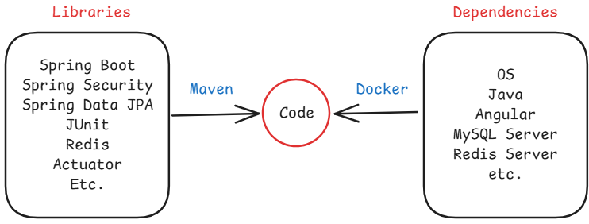
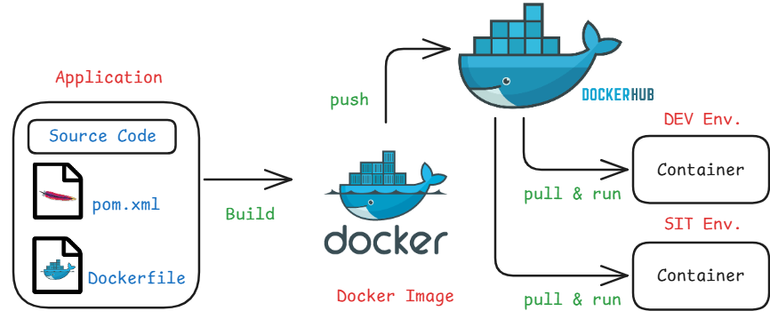
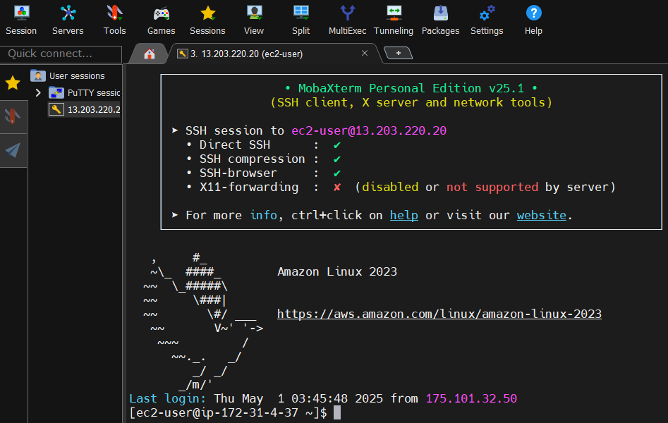
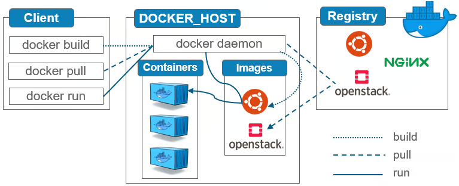
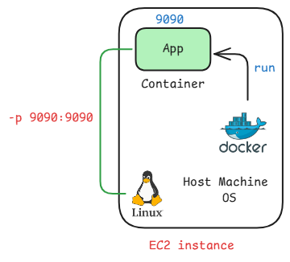
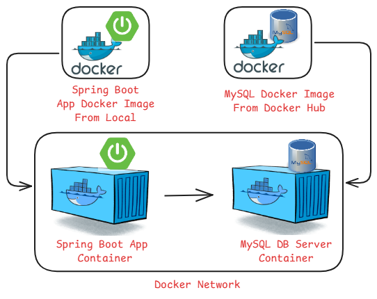

# Docker

[Articles](https://nirmalakumarsahu.in/articles.html) | [My Profile](https://nirmalakumarsahu.in)

[](https://www.docker.com/) [](https://www.docker.com/)

[](https://en.wikipedia.org/wiki/DevOps)

---

## Index
- [What is Docker?](#what-is-docker)
  - [Issues Without Docker](#issues-without-docker)
  - [Containerization](#containerization)
- [Docker Registry](#docker-registry)
- [Docker Setup on AWS EC2](#docker-setup-on-aws-ec2)
- [Docker Architecture](#docker-architecture)
  - [Docker Commands](#docker-commands)

---

## What is Docker?

- **Docker** is an open-source containerization software that enables developers to build, ship, and run applications using containers.

- **Containers** are lightweight, isolated environments that bundle an application with all its dependencies, ensuring it runs consistently across different environments.

- **Benefits of Docker**
  - **Portability**: Run applications anywhere, from local machines to cloud servers.
  - **Scalability**: Easily scale applications up or down with container orchestration.
  - **Consistency**: Eliminate issues caused by differences between development and production.
  - **Resource Efficiency**: Use system resources more efficiently compared to traditional virtual machines.

### Issues Without Docker

- **"It works on my machine" syndrome**: Applications behave differently in development, testing, and production due to inconsistent environments.

- **Complex setup and configuration**: Installing and configuring dependencies on every system can be time-consuming and error-prone.

- **Lack of environment isolation**: Multiple applications on the same machine can conflict over dependencies or versions.

- **Difficult scaling and deployment**: Manual deployment processes are slow, error-prone, and hard to scale reliably.

- **Harder collaboration**: Sharing and replicating environments across teams is difficult without a consistent runtime setup.

- **Increased system resource usage**: Traditional virtual machines are heavier and less efficient compared to containers.

> **Note**: To run our application, three key things are needed:
> - The code written by the developer.
> - Required libraries to execute the code (managed and downloaded using tools like Maven).
> - External software or system dependencies (e.g., databases, runtime environments) that are necessary for the application to run.

Installing and configuring all of these manually on different machines can be time-consuming and error-prone. **Docker helps by packaging the application, its libraries, and all required dependencies into a single container**, ensuring it runs consistently across any environment.



### Containerization 

- **Containerization** is the process of packaging software code and all its dependencies into containers.

- A **container** is a lightweight, portable virtual environment (not a full virtual machine).

- It ensures that the application runs reliably regardless of where it's deployed.

- **Popular containerization tools** include Docker, Podman, and LXC. 

- **Benefits of Containerization**
  - **Portability**: Run anywhere — local, staging, or production.
  - **Isolation**: Each container runs independently, reducing conflicts.
  - **Scalability**: Easily scale up or down using orchestrators like Kubernetes.
  - **Speed**: Faster boot times compared to VMs.
  - **Efficiency**: Lower resource usage by sharing the host OS kernel.

### [🔝 Back to Top](#index)

---

## Docker Registry

- A **Docker Registry** is a storage and distribution system for Docker images.

- It allows you to push, pull, and manage container images. 

- There are two types of registries
  - **Public** (accessible to anyone)
    - Ex: Docker Hub, GitHub Container Registry, Amazon ECR, Google Artifact Registry, Microsoft Azure Container Registry (ACR)
  - **Private** (restricted access)
    - Ex: Harbor, JFrog Artifactory, Sonatype Nexus Repository, Self-hosted Docker Registry

### Docker Hub

- **Docker Hub** is a public Docker Registry service provided by Docker Inc.

- It is the default registry used when you run `docker pull` or `docker push` without specifying a registry.

- It hosts official images, user-contributed images, and private repositories (with a free tier and paid options).



> **Note**: In real-time production environments, we use Kubernetes (e.g., EKS) to run containers. Docker is used here for image creation and testing.

### [🔝 Back to Top](#index)

---

## Docker Setup on AWS EC2 

**Step 1:** Launch an EC2 Instance on AWS Cloud

- **Log in** to your AWS account and go to **EC2 > Launch Instance**, then configure the following details 
for the instance:
  - **Name**: `docker-serv`
  - **Application and OS Image**: Amazon Linux
  - **Instance type**: `t2.micro` (Free Tier Eligible)
  - **Key pair**: Create new or choose existing
  - **Network settings**: Leave default
- Then click on **Launch instance**, Now you can see the instance. 
- After create the EC2 instance, choose the instance and click on **Connect**, then collect **Public IPv4 address** and **Username**.

- To create a key pair: Click on Create new key pair then give
  - **Key pair name**: `docker-key-pair`
  - **Key pair type**: RSA
  - **File format**: `.pem`
  - Click **Create key pair** then it will download the private key pem file.

**Step 2:** Connect to EC2 instance Using MobaXterm from your local machine 

- Install **[MobaXterm](https://download.mobatek.net/2512025030285413/MobaXterm_Installer_v25.1.zip)** if not already installed.
- Create a new SSH session, for that click on **Session** tab then choose **SSH**.
  - **Remote host**: Your EC2 Public IPv4 address
  - **Specify Username**:
    - `ec2-user` for Amazon Linux
    - `ubuntu` for Ubuntu
- Then Under **Advanced SSH settings** provide the `.pem` file under **User private key** then click **OK** to connect.

> **Note:** If you see the terminal of your EC2, then you're successfully connected.



**Step 3:** Install Docker

- For Amazon Linux:

```shell
sudo yum update -y
sudo yum install docker -y
sudo service docker start
sudo usermod -aG docker ec2-user
exit
```

- For Ubuntu:

```shell
sudo apt update
curl -fsSL get.docker.com | /bin/bash
sudo usermod -aG docker ubuntu 
exit
```

- After run the commands it will ask to restart click on R. Now we can verify the docker version and docker is running or not by using following commands

```shell
docker -v
docker info
```

> **Note:** Crate an account on [Docker Hub](https://hub.docker.com/)

### [🔝 Back to Top](#index)

---

## Docker Architecture

- The Docker client sent a request to the Docker daemon (the background service that handles containers).

- The Docker daemon downloaded the hello-world or the given image from Docker Hub (a public image registry).

- Using that image, the Docker daemon created and started a container, which executed a small program.

- The output from that program was sent back from the container to the Docker client and displayed in your terminal.
 
> **Note:**
> - Docker client: The command-line tool (docker) that you use to interact with Docker.
> - Docker daemon: A background process (dockerd) that manages Docker objects like images and containers.



### Docker Commands

| Command                              | Description |
|--------------------------------------|-------------|
| `docker images`                      | List all local images |
| `docker pull <image-name>`           | Pull an image from Docker Hub |
| `docker run <image-name / image-id>` | Run a container from an image |
| `docker ps`                          | List running containers |
| `docker ps -a`                       | List all containers (including stopped) |
| `docker stop <container-id>`         | Stop a running container |
| `docker start <container-id>`        | Start a stopped container |
| `docker rm <container-id>`           | Remove a container |
| `docker rmi <image-id>`              | Remove an image |
| `docker system prune -a`             | Clean up unused containers/images |
| `docker logs <container-id>`         | View logs of a container |

**Example**

```shell
docker pull hello-world
docker run hello-world
```


> Instead of manually pulling the image, we can directly run it using docker run. Docker will first check if the image exists locally. If it’s not found, it will automatically download (pull) the image from Docker Hub and then run the container.

**Let’s run a Spring boot Rest API**
- Before proceeding, it’s important to understand that in an EC2 instance, we have a host machine, but our application runs inside a Docker container. Since containers are isolated from the host system, we can't access the application directly from outside. To enable external access, we need to configure port mapping, which links a port on the host machine to a port inside the container.



```shell
docker run -d -p 9090:9090 ashokit/spring-boot-rest-api
```
 
  - **-d:** restands for detached mode, which runs the container in the background and frees up the terminal so you can continue running other commands.
  - **-p:** is used for port mapping between the host and the container

> **Note:** The first 9090 is the host port (your EC2 or local machine), and the second 9090 is the container port. This means that requests to port 9090 on the host will be forwarded to port 9090 inside the container.

- After run the command you can check the docker image and docker containers got created.
- Now, to access the application from outside, we need to allow inbound traffic on the EC2 instance by updating its security group settings to open the mapped port.
- For that follow the below steps:
  - Go to your **EC2** instance in the **AWS Console**. 
  - Click the **Security** tab. 
  - Under **Security details**, click on the linked **Security Group** name. 
  - Navigate to the **Inbound rules** tab and click **Edit inbound rules**. 
  - Click **Add rule** and configure the following:
    - **Type:** `Custom TCP` 
    - **Port range:** `9090 [host port]` 
    - **Source:** `Anywhere-IPv4` (or restrict to your IP for better security)
    - Click **Save rules** to apply the changes.
- Now to access the application 
  - URL: http://`Public IP`:`port`/welcome/sahu

### [🔝 Back to Top](#index)

---

## Dockerfile

- A Dockerfile is a plain text file that contains a series of instructions used by Docker to automate the creation of a Docker image.

- Each instruction in a Dockerfile builds a layer in the image, allowing Docker to efficiently reuse and cache layers.

- Recommended naming convention: `Dockerfile`

#### Purpose of a Dockerfile

- Define the base image (e.g., Ubuntu, OpenJDK, Node, etc.)
- Install necessary application dependencies
- Copy your source code and other required files into the image
- Set environment variables if needed
- Expose the necessary network ports
- Define the entry point or the command to run when the container starts

### Dockerfile Instructions or Keywords

#### FROM

- Specifies the base image needed to build the Docker image.
- A base image contains pre-installed dependencies or software required to run your application.

  ```dockerfile
  FROM openjdk:21
  FROM tomcat:8.5
  FROM mysql:8.5
  FROM python:3.1
  FROM node:19
  ```

#### MAINTAINER (Deprecated)

- Specifies the author or maintainer of the Dockerfile.
- This is optional and mainly for documentation.

  ```dockerfile
  MAINTAINER nirmalakumarsahu@gmail.com
  ```

> **Note:** The MAINTAINER instruction is deprecated in favor of `LABEL`
>  ```dockerfile
>  LABEL maintainer="nirmalakumarsahu@gmail.com"
>  ```

#### COPY

- Copies files/ folders from the host machine to the container file system.

  ```dockerfile
  COPY target/app.jar /user/app/tomcat/webapp.war
  ```

#### RUN

- Executes shell commands while building the Docker image.

  ```dockerfile
  RUN yum install -y git
  RUN yum install -y maven
  RUN git clone <repo>
  ```
> **Note:** Multiple RUN instructions are executed in order, from top to bottom.

#### CMD

- Specifies the default command to run when a container starts.

  ```dockerfile
  CMD ["java", "-jar", "app.jar"]
  ```

> **Notes:**
> - If we write multiple CMD instructions, only the last CMD in the Dockerfile is executed.
> - CMD can be overridden at runtime (docker run). 
> - If we want to top override the instruction then we have to user ENTRYPOINT.


#### ENTRYPOINT
 
- Defines the command to run when the container starts.
- Unlike CMD, it cannot be overridden easily at runtime.
* Preferred when you want the container should run always a specific command.

  ```dockerfile
  ENTRYPOINT ["java", "-jar", "app.jar"]
  ```

#### EXPOSE

- Documents the port on which the container runs.
- It does not actually publish the port.

  ```dockerfile
  EXPOSE 8080
  ```

#### WORKDIR

- Sets the working directory inside the container.
- Any subsequent instructions (like COPY, RUN, etc.) will be relative to this directory.

  ```dockerfile
  WORKDIR /usr/app/
  ```

#### ENV

- Sets environment variables inside the container.

  ```dockerfile
  ENV APP_ENV=production
  ```

#### Sample Dockerfile

- Open or Create a File in Linux
  ```shell
  vi Dockerfile
  ```
- Enter Insert Mode (for typing), press **i** to enter Insert Mode.
- Now you can type or paste content into the file.
- To save and exist press **Esc** to exit insert mode. Then type **:wq** and hit Enter (:wq = Write + Quit).
- To exit without saving press **Esc**, then type **:q!** and hit Enter

> **Note:** To read more about [vi/ vim](https://nirmalakumarsahu.github.io/articles/linux/linux-text-editors)

**Dockerfile**

```dockerfile
FROM ubuntu

MAINTAINER <Nirmala Kumar Sahu>

RUN echo 'run msg 1'
RUN echo 'run msg 2'

CMD echo 'CMD msg 1'
CMD echo 'CMD msg 2'
```

### To Build a Docker Image

- Building a Docker image involves packaging your application and its dependencies into a portable container image using a Dockerfile. This image serves as a blueprint for creating containers.

```shell
docker build -t <image-name>:<tag> .
# or
docker build -t <image-name> .
```

  - **docker build:** This is the base command used to build a Docker image from the instructions in a Dockerfile located in the specified context. 
  - **-t <image-name>:<tag>**
    - The **-t** flag is used to tag the image with a name and optionally a version (tag).
    - **<image-name>:** The name you want to assign to the image (e.g., my-app, web-server, python-app).
    - **<tag>:** The tag to specify a version or variant (e.g., latest, v1, prod). If you don't specify a tag, it defaults to latest. 
  - **. (dot)**
    - The dot (.) represents the build context, which in most cases is the current directory. 
    - It tells Docker to use the current directory to look for the Dockerfile and any associated files needed to build the image. 
    - If your Dockerfile is in another location, replace the dot with that directory's path (e.g., /path/to/dir).

> Notes: If you use a different name instead of 'Dockerfile', you must specify the file name using the -f option before the build context (e.g: .)
> ```shell
>  docker build -t <image-name>:<tag> -f <custom docker file> .
>  ```

### To Run a Docker Image

-  	Running a Docker image means creating and starting a container based on that image. You use the docker run command for this.

```shell
docker run <image-name>
```

> **Note:**
> - RUN is executed during the image build process when the image is created. 
> - CMD is executed when the container is run from the image and if multiple CMD instructions are present, Docker uses only the last one


### To Push a Docker Image to Docker Hub

-  	Pushing an image to Docker Hub makes it accessible from anywhere, allowing others (or your deployments) to pull and run the image.

#### Steps:

1. Create an image using your Docker Hub username as a prefix, like this:

   ```shell
   docker build -t dockerhub-username/image-name:tag .
   #or
   docker build -t dockerhub-username/image-name .
 
   # Example
   docker build -t nirmalakumarsahu/app1:1.0 .
   ```

2. Login to Docker Hub, enter your Docker Hub username and password/ token when prompted.

   ```shell
   docker login
   ```
   
3. Push the image:

   ```shell
   docker push dockerhub-username/image-name:tag
   #or
   docker push dockerhub-username/image-name
   
   #Example
   docker push nirmalakumarsahu/app1:1.0
   ```

> **Note:**
> - After push you can login into you docker hub account and you can see the images.
> - If not already tagged with your Docker Hub username:
> ```sh
> docker tag image-name dockerhub-username/image-name:tag
> #or
> docker tag image-name dockerhub-username/image-name
> ```
> - Different programming languages [Dockerfile](https://github.com/nirmalakumarsahu/deployment-files)

### Dockerfile for Java Web Application

**Dockerfile**

```dockerfile
FROM tomcat-jre-1.8:9.5

MAINTAINER <Nirmala Kumar Sahu>

EXPOSE 8080

COPY target/app.war /usr/app/local/tomcat/webapps
```

### Dockerfile Spring Boot Application

**Dockerfile**

```dockerfile
FROM openjdk:11

LABEL maintainer="Nirmala Kumar Sahu"

WORKDIR /app

COPY target/sbapp.jar sbapp.jar

EXPOSE 8080

ENTRYPOINT [“java”, “-jar”, “sbapp.jar”]
```

### Dockerizing Spring Boot Application

1. Install Git and Clone the Repository [spring-boot-docker-app](https://github.com/nirmalakumarsahu/spring-boot-docker-app.git)
   
   ```shell
   sudo yum install git -y
   git clone <repo-url>
   ```
   
2. Install Maven

   ```shell
   sudo yum install maven -y
   ```

3. Navigate to the Project Directory and Build the Application

   ```shell
   cd <project-directory>
   mvn clean package
   ```

4. Build the Docker Image
   ```shell
   docker build -t your-image-name .
   ```
      
5. Run the Docker Container
   ```shell
   docker run -d -p 8090:8090 your-image-name
   ```
   
6. Enable host port in security group and access the application.

    http://`Public IP`:`port`/api/v1/home/greeting

> **Note:** Ensure that the Java version used by Maven and on your EC2 instance matches the Java version specified in your project.

### [🔝 Back to Top](#index)

---

## Docker Compose

- Docker Compose is a tool that allows you to define and manage multi-container Docker applications.

- It allows you to configure all your application's services (like databases, APIs, message queues, etc.) in a single docker-compose.yml file and start and run them with a single command.

- When we are working with microservices based application we will have multiple services, every service will have its own docker images.

### Key Features

- **Multi-container Deployment:** Easily run multiple containers (e.g., app, database, cache) together by defining each as a service in the `docker-compose.yml` file.

- **Service Configuration:** Configure containers using images, ports, environment variables (e.g., DB credentials), volumes (persistent storage), and networks (container communication).

- **One-Command Startup:** Bring up all services with a single docker-compose up command, simplifying startup and management.

- **Build and Customization:** Use the build directive to specify how to build Docker images, often using a Dockerfile.

- **Service Dependencies:** Control the order of container startup using depends_on, ensuring one container starts before another.

- **Isolation:** Compose creates an isolated network for your containers, ensuring they run in their own private environment.

### Why Use Docker Compose?

- **Simplifies Development:** Run all required services with a single command, avoiding multiple docker run calls.

- **Enables Easy Testing:** Mimic production environments locally for effective integration testing.
 	
- **Manages Service Dependencies:** Clearly define which services rely on others (e.g., backend depends on the database).
 	
- **Supports Reusability:** Use the same docker-compose.yml for development, CI/CD, staging, and production.
 	
- **Provides Network Isolation:** Automatically creates an isolated network for all application services.

### Key Concepts in Docker Compose

- Docker Compose allows you to define and run multi-container applications using a simple YAML file (docker-compose.yml). 

- Below are the key components you'll use in a Compose file:

#### services

-	Defines each container (or app component) you want to run.
-	Each service runs one container and can be built from an image or source.

```yaml
services:
  <service-name>:
    image: <image-name>
```

#### image

- Specifies the Docker image to use for the service. 
- You can use public images from Docker Hub or private/custom ones.

```yaml
image: <image-name>
```

#### build

- Tells Docker Compose how to build the image using a Dockerfile.

```yaml
build:
  context: ./app
  dockerfile: Dockerfile
```

#### container\_name

- Sets a custom name for the container instead of the default auto-generated one.

```yaml
container_name: <container-name>
```

#### command

- Overrides the default command defined in the Dockerfile (CMD).
- Useful for customizing what runs inside the container.

```yaml
command: ["java", "start"]
```

#### ports

- Maps ports between the container and the host so services can be accessed externally.

```yaml
ports:
  - "8080:80"
```

#### environment

- Defines environment variables that will be available inside the container.
- Often used for configs, credentials, and app settings.

```yaml
environment:
  - MYSQL_ROOT_PASSWORD=root
  - MYSQL_DATABASE=mydb
```

#### volumes

- Mounts data from the host to the container, or between containers.
- Useful for persisting data, sharing files, or live development.

```yaml
volumes:
  - ./data:/var/lib/mysql
  - db-data:/var/lib/mysql
```

#### networks

- Defines and connects services to Docker networks for container-to-container communication. 

```yaml
networks:
  - backend
```

#### depends\_on

- Controls the startup order of services.
- Ensures one service starts before another, though it doesn’t wait for it to become “ready.”

```yaml
depends_on:
  - db
```

#### Example docker-compose.yml

```yaml
version: '3.8'
services:
  mysql:
    image: mysql:8
    container_name: mysql
    environment:
      MYSQL_ROOT_PASSWORD: root
      MYSQL_DATABASE: mydatabase
    networks:
      - spring-net

  springboot-app:
    image: my-springboot-app:latest
    container_name: springboot-app
    depends_on:
      - mysql
    environment:
      SPRING_DATASOURCE_URL: jdbc:mysql://mysql:3306/mydatabase
      SPRING_DATASOURCE_USERNAME: root
      SPRING_DATASOURCE_PASSWORD: root
    networks:
      - spring-net

networks:
  spring-net:
    driver: bridge
```

### Docker Compose Commands (v2.x)

- Docker Compose v2.x introduced several changes from v1.x, especially around integration with the docker CLI. In v2, the docker-compose command is replaced by docker compose (without the hyphen). Here's a list of commonly used Docker Compose v2.x commands:

| Command                                      | Description                                                             |
|----------------------------------------------|-------------------------------------------------------------------------|
| `docker compose up`                          | Start services defined in `docker-compose.yml`.                         |
| `docker compose up -d`                       | Start services in detached mode (background).                           |
| `docker compose down`                        | Stop and remove containers, networks, volumes, and images created by up.|
| `docker compose ps`                          | List containers related to the Compose project.                         |
| `docker compose stop`                        | Stop running containers without removing them.                          |
| `docker compose start`                       | Start existing (stopped) containers.                                    |
| `docker compose restart`                     | Restart services.                                                       |
| `docker compose logs`                        | View logs of the services.                                              |
| `docker compose logs -f`                     | Follow logs output (real-time).                                         |
| `docker compose build`                       | Build or rebuild services.                                              |
| `docker compose pull`                        | Pull service images.                                                    |
| `docker compose push`                        | Push service images.                                                    |
| `docker compose exec <service> <command>`    | Run a command inside a running container (e.g., `bash`).                |
| `docker compose run <service> <command>`     | Run one-off command (creates a new container).                          |
| `docker compose config`                      | Validate and view the merged Compose file configuration.                |

### [🔝 Back to Top](#index)

---

## Docker Networks

- Docker Network is a system that enables containers to communicate with each other and with external systems.

- By default, each container is isolated, but Docker networks allow secure and efficient inter-container communication.

- In essence, a Docker network connects Docker containers, giving them the ability to:
  - Discover and talk to each other by name 
  - Access external services 
  - Be isolated or exposed as needed

- There are different type of docker networks are available


### Types of Docker Networks

#### bridge (default)

- Default network type in Docker Compose.
- Containers in the same Compose file automatically use a custom bridge network.
- They can communicate using service names as hostnames.
- You usually don’t need to define this manually unless you want a specific name or use across multiple Compose files.

```yaml
networks:
  my-bridge:
    driver: bridge
```

#### host

- The container shares the host’s networking stack (no isolation).
- Not supported on Docker Desktop (Windows/macOS).
- Use only on Linux for special cases.

```yaml
network_mode: host
```

#### none

- No network interface is created inside the container.
- The container is completely isolated.

```yaml
network_mode: none
```

#### overlay (for Docker Swarm)

- Used in Docker Swarm mode.
- Allows containers running on different Docker hosts to communicate.
- Not applicable for standalone Docker Compose (only works with docker stack deploy).

```yaml
networks:
  my-overlay:
    driver: overlay
```

#### macvlan

- Gives containers their own IP on your local network.
- Acts like a physical device on the LAN.
- Complex setup and rarely used in basic Docker Compose setups.

```yaml
networks:
  macvlan_network:
    ipv4_address: 192.168.1.101
```

### [🔝 Back to Top](#index)

---

## Dockerizing Spring Boot App with MySQL using Docker Compose

- A MySQL Docker image (pulled from Docker Hub) → we use it to create a MySQL container.
- Our Spring Boot code → we build a Docker image from it → then run it as a Spring Boot container.
- To make them communicate, both containers must run in the same Docker network. This way, the Spring Boot app can connect to the MySQL container using its name.




**Step 1:** Install Docker compose if not installed

- **For Amazon Linux:** Amazon Linux 2 now supports Compose v2, which is a plugin for Docker CLI
```shell
# Create the CLI plugin directory
mkdir -p ~/.docker/cli-plugins

# Download the latest Docker Compose binary
curl -SL https://github.com/docker/compose/releases/download/v2.35.1/docker-compose-linux-x86_64 \
-o $DOCKER_CONFIG/cli-plugins/docker-compose

# Make the binary executable
chmod +x $DOCKER_CONFIG/cli-plugins/docker-compose

# Test version
docker compose version
```

- **For Ubuntu:**
```shell
# Create the CLI plugin directory
mkdir -p ~/.docker/cli-plugins

# Download the latest Docker Compose binary
curl -SL https://github.com/docker/compose/releases/download/v2.35.1/docker-compose-linux-x86_64 \
-o ~/.docker/cli-plugins/docker-compose

# Make the binary executable
chmod +x ~/.docker/cli-plugins/docker-compose

# Test version
docker compose version
```

**Step 2:** Clone the Repository [spring-boot-docker-app](https://github.com/nirmalakumarsahu/spring-boot-docker-app.git)

```shell
git clone <repo-url>
```

**Step 3:** Navigate to the Project Directory and Build the Application

```shell
cd <project-directory>
mvn clean package
```

**Step 4:** Build the Docker Image

```shell
docker build -t your-image-name .
```

>**Note:**
>- Make sure to use the same application image name as specified in the Docker Compose file.
>- In your application.properties file, the database URL (spring.datasource.url) should use the MySQL container name defined in the docker-compose.yml file

**Step 5:** Run the Docker Container using docker compose

```shell
docker compose up -d
```

**Step 6:** Enable host port in security group and access the application.

http://`Public IP`:`port`/

### [🔝 Back to Top](#index)

### [Read More ➡️](https://nirmalakumarsahu.in/articles.html)

---